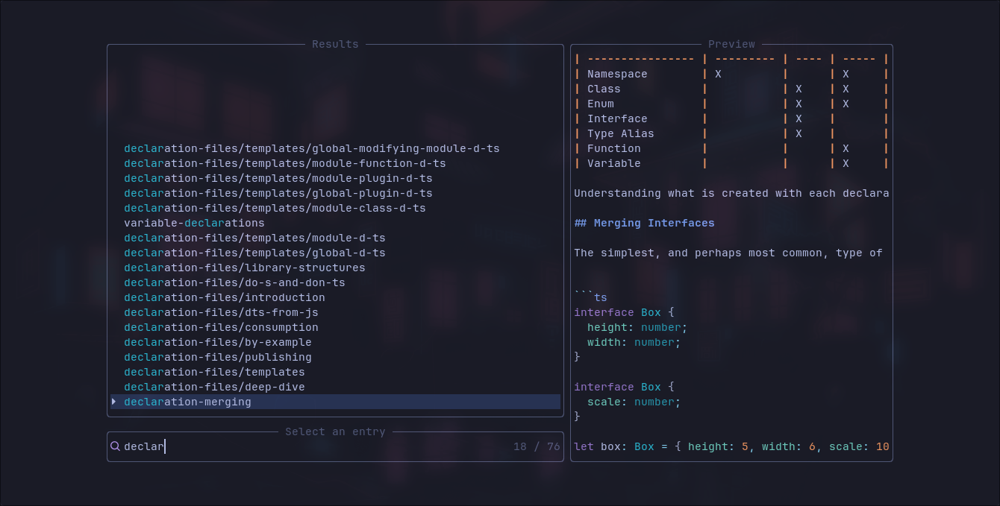
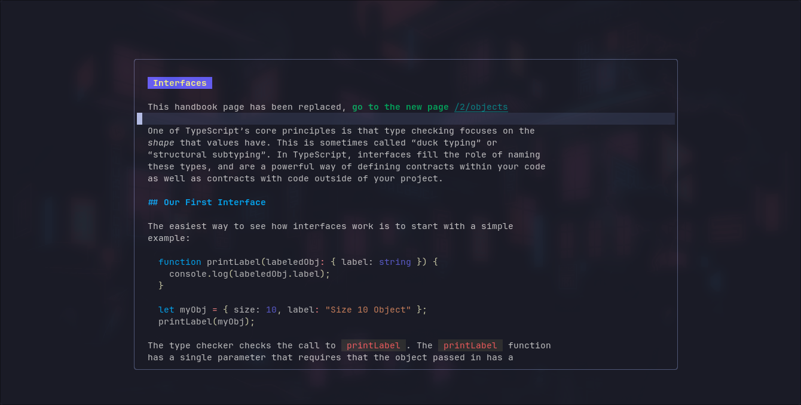

# nvim-devdocs

nvim-devdocs is a plugin which brings [DevDocs](https://devdocs.io) documentations into neovim. Install, search and preview documentations directly inside neovim in markdown format with telescope integration. You can also use custom commands like [glow](https://github.com/charmbracelet/glow) to render the markdown for a better experience.

## Preview



Using [glow](https://github.com/charmbracelet/glow) for rendering markdown:



## Installation

Lazy:

```lua
return {
  "luckasRanarison/nvim-devdocs",
  dependencies = {
    "nvim-lua/plenary.nvim",
    "nvim-telescope/telescope.nvim",
    "nvim-treesitter/nvim-treesitter",
  },
  opts = {}
}
```

Packer:

```lua
use {
  "luckasRanarison/nvim-devdocs",
  requires = {
    "nvim-lua/plenary.nvim",
    "nvim-telescope/telescope.nvim",
    "nvim-treesitter/nvim-treesitter",
  },
  config = function()
    require("nvim-devdocs").setup()
  end
}
```

The plugin uses treesitter API for converting HTML to markdown so make sure you have treesitter `html` parser installed.

Inside your treesitter configuration:

```lua
{
  ensure_installed = { "html" },
}
```

## Configuration

Here is the default configuration:

```lua
{
  dir_path = vim.fn.stdpath("data") .. "/devdocs", -- installation directory
  telescope = {}, -- passed to the telescope picker
  float_win = { -- passed to nvim_open_win(), see :h api-floatwin
    relative = "editor",
    height = 25,
    width = 100,
    border = "rounded",
  },
  wrap = false, -- text wrap, only applies to floating window
  previewer_cmd = nil, -- for example: "glow"
  cmd_args = {}, -- example using glow: { "-s", "dark", "-w", "80" }
  cmd_ignore = {}, -- ignore cmd rendering for the listed docs
  picker_cmd = false, -- use cmd previewer in picker preview
  picker_cmd_args = {}, -- example using glow: { "-p" }
  ensure_installed = {}, -- get automatically installed
}
```

## Usage

To use the documentations from nvim-devdocs, you need to install it by executing `:DevdocsInstall`. The documentation is indexed and built during the download. Since the building process is done synchronously and may block input, you may want to download larger documents (more than 10MB) in headless mode: `nvim --headless +"DevdocsInstall rust"`.

## Commands

Available commands:

- `DevdocsFetch`: Fetch DevDocs metadata.
- `DevdocsInstall`: Install documentation, 0-n args.
- `DevdocsUninstall`: Uninstall documentation, 0-n args.
- `DevdocsOpen`: Open documentation in a normal buffer, 0 or 1 arg.
- `DevdocsOpenFloat`: Open documentation in a floating window, 0 or 1 arg.
- `DevdocsOpenCurrent`: Open documentation for the current filetype in a normal buffer.
- `DevdocsOpenCurrentFloat`: Open documentation for the current filetype in a floating window.
- `DevdocsUpdate`: Update documentation, 0-n args.
- `DevdocsUpdateAll`: Update all documentations.

Commands support completion, and the Telescope picker will be used when no argument is provided.

## TODO

- More search options
- External previewers.
- More features.

## Contributing

The HTML converter is still experimental, and not all documentation has been thoroughly tested yet. If you encounter rendering issues, feel free to submit an [issue](https://github.com/luckasRanarison/nvim-devdocs/issues).

Pull requests and feature requests are welcome!

## Similar projects

- [nvim-telescope-zeal-cli](https://gitlab.com/ivan-cukic/nvim-telescope-zeal-cli) Show Zeal documentation pages in Neovim Telescope.

## Credits

- [The DevDocs project](https://github.com/freeCodeCamp/devdocs) for the documentations.
- [devdocs.el](https://github.com/astoff/devdocs.el) for inspiration.
